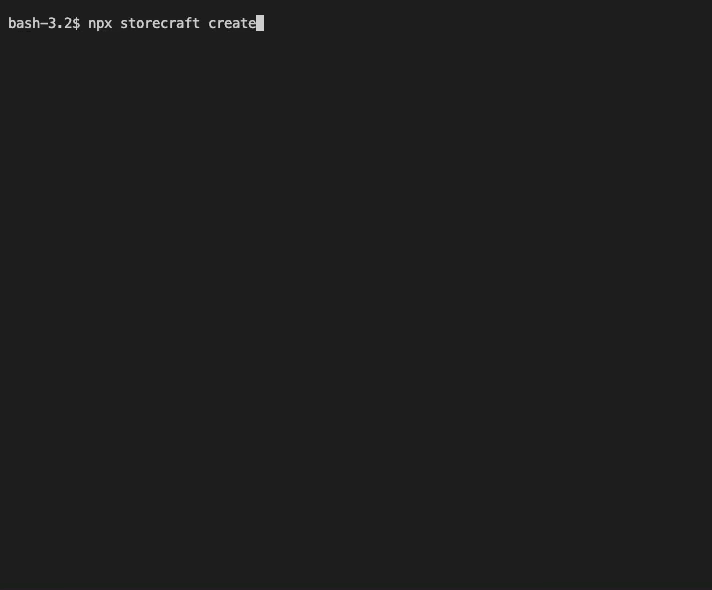

# **Storecraft** Official CLI

<div style="text-align:center">
  
</div><hr/><br/>

This CLI will help you bootstrap a repo and code to start a storecraft app.

<div style="text-align:center">
  
</div><hr/><br/>

### create a store with

```zsh
npx storecraft create
```
Then, 

### migrate a store database with

```zsh
npm run migrate
npm start
```
